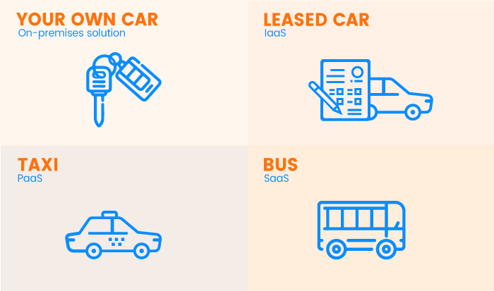

# Cloud Fundamentals

What is the Cloud Computing? 

- Cloud computing is the **on-demand delivery** of computing power, database storage, applications and other IT resources. 

- Cloud Services are provided with a **Pay-as-you-go Pricing**

- You can provision exactly the right **type and size** of computing resources you need and access them **instantly!**
#
## Cloud Deployment Models

#
## Cloud Characteristics

- On demand service, provisioning resources without human interaction.
- Broad Network access, resources available over the network can be acceseed by multiple client platforms. 
- Multi-tenancy, multiple customers can share the same infrastructure and are serviced from the same physical resources. 
- Rapid scalability, you can quickly and automatically aquire and dispose of resources based on demand. 
- Measured service, usage is measured so users pay correctly for what they use. 
#
## IaaS, PaaS, and SaaS

- IaaS (Infrastructure as a Service): Provides the infrastructure such as virtual machines and other resources like virtual-machine disk image library, block and file-based storage, firewalls, load balancers, IP addresses, virtual local area networks etc.

- PaaS (Platform as a Service): This is used for applications, and other development, while providing cloud components to software. This includes development tools, database management, business intelligence (BI) services, etc.

- SaaS (Software as a Service): In this service model, the cloud-based applications are provided to the user, as a service on demand. It is a single instance of the service running on the cloud and multiple end users are serviced.

- On-premises IT infrastructure is like owning a car. When you buy a car, you’re responsible for its maintenance, and upgrading means buying a new car.

- IaaS is like leasing a car. When you lease a car, you choose the car you want and drive it wherever you wish, but the car isn’t yours. Want an upgrade? Just lease a different car!

- PaaS is like taking a taxi. You don’t drive a taxi yourself, but simply tell the driver where you need to go and relax in the back seat.

- SaaS is like going by bus. Buses have assigned routes, and you share the ride with other passengers.

#
## AWS Region Selection

**Compliance** - Data governance and legal requirements for keeping data in a region.

**Proximity** - Reduced latency for customers.

**Availability** - Services are not available in every region.

**Pricing** - Pricing varies based on region. 

#
## AWS Responsibility
You need to understand what YOU are responsible for and what AWS is responsible for.

# Cloud Security

There are many ways to implement security on the cloud such as: IAM, AWS access keys and more.

## IAM
IAM = Idenity and Access Managment (Global service)

**Root** users are created by default but shouldn't be used.

**Instead** create users for the organisation, these users can be grouped and provided permissions. 

#
### IAM Permissions

- Users or Groups can be assigned JSON documents called policies

- Policies define the permissions of the user

- Always apply the **Least privilege principle**: don't give more than a user needs. 

#
### IAM Creation

By navigating to the IAM tool, you can create users and groups. 

To create a user: 

To set permissions, it's best to create a group:

You can now add users to this group and they will inherit all attached policies.

You can also email the login instructions to that user!

#
### IAM Policies

The policy structure in JSON files:

These policies can be:

- Attached from Group: given access via a group policy

- Attached directly: given access directly with no links. 

You can also create your own policy! using either a JSON file or the visual editor. 
#
### IAM Security, Password Policy
Password policies are one of the ways you can protect your IAMs:

- Request strong passwords only
- Minimum password lengths
- Specific character types
- Require password expiration
- Prevent password re-use
#
### IAM Security, Multi Factor Authentication

MFA can be used to protect your root accounts and IAM users. 

MFA combines the password you know AND security device you own. 

Even if the password is compromised, the account will not be compromised as the the physical device is required. 

MFA options: 

#
## AWS Access Keys, CLI and SDK

There are three ways to access AWS: 

- AWS managment console (Password + MFA)
- AWS Command line interface (CLI) (Access Keys)
- AWS Software Developer Kit (SDK) (Access Keys)

Access keys are generated through the AWS Console and are managed by the user that owns them.

#
### AWS CLI

AWS CLI is a tool you can use to interact with AWS services using commands in your command-line shell. 

It gives you direct access to the public APIs of AWS services and you can develop script to manage resources. 

Logging in: 
- `aws configure`
- `<Access Key>`
- `<Secret Access Key>`
- `<Region Name>`

- `aws iam list-users` will give all users in my account
#
### AWS SDK

SDK is the Software Development Kit, it is actually integrated within your application to access and manage AWS services programmatically while supporting a large variety of languages and libraries. 

### AWS Cloudshell

Cloudshell is a terminal in the cloud and it's free to use!

You can use ACLI commands the same way! You have your own repository, you can create files and all files in this environment will stay. It can be configured and scaled. This means you can download or upload files to and from it. 

### IAM roles for AWS services

Some AWS services will need to take action on our behalf so:

IAM roles are used to assign permissions to the services.

IAM roles are similar to how users have policies.

Summary:

