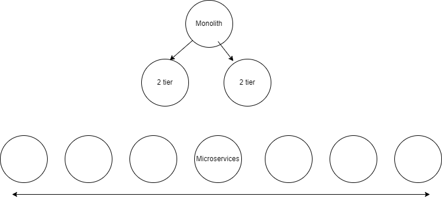

# Table of Contents

- [Table of Contents](#table-of-contents)
- [DevOps Fundamentals](#devops-fundamentals)
  - [What is DevOps?](#what-is-devops?)
  - [The Software Development Life Cycle (SDLC):](#the-software-development-life-cycle-sdlc)
  - [Development Architecture](#development-architecture)
- [Git and Github](#git-and-github)
  - [Git Setup](#git-setup)
    - [Creating a Git Repo](#creating-a-git-repo)
    - [Copying Local Repo to Github](#copying-local-repo-to-github)
    - [Copying Github Repo to Local](#copying-github-repo-to-local)
  - [Git Commands](#git-commands)
- [Virtualisation](#virtualisation)
  - [Kernel vs Shell](#kernel-vs-shell)
  - [Virtual Machines](#virtual-machines)
    - [Vagrant](#vagrant)
    - [Vagrant Commands](#vagrant-commands)
  - [NGINX](#nginx-deployment-with-vagrant)
    - [NGINX Setup](#nginx-setup) 
    - [NGINX Reverse Proxy](#nginx-reverse-proxy)
  - [Linux](#linux)
    - [Linux Commands](#linux-commands)
    - [Linux Permissions](#linux-permissions)
    - [Nano Commands](#nano-commands)
    - [Bash Scripting (Shebang)](#bash-scripting-shebang)
  - [Integrating Dev Code](#integrating-dev-code)
    - [Set up the Vagrant VM](#set-up-the-vagrant-vm)
    - [Finding Dependencies with Ruby](#finding-dependencies-with-ruby)
    - [NodeJS and NPM in the APP VM](#nodejs-and-npm-in-the-app-vm)


# DevOps Fundamentals
## What is Devops?
DevOps is a collaborative approach to software development that combines development (Dev) and IT operations (Ops).

DevOps emphasizes communication, collaboration, integration, automation, and transparency among developers and IT operations to improve the speed and quality of software delivery.


#
## The Software Development Life Cycle (SDLC):

### ***First Phase:***
### 1. Defining the Objective

- This stage involves understanding and documenting the problem that the software is meant to solve.
- Stakeholders, such as customers, end users, or business analysts, provide input to clarify the software's purpose and main features.

### 2. Planning Stage

- The project's scope, resources, timeline, and potential risks are identified and outlined.
- This phase sets the groundwork for the rest of the project and helps avoid future delays and cost overruns.

### 3. Design Stage

- Based on the objectives and plan, a detailed software design is created, specifying how the software will function and how its components will interact.
- This design acts as a blueprint for the next stages of development, guiding the coding process.

### **Second Phase**

### 4. Coding Stage

- In this phase, developers translate the design into code, creating the actual software.
- Each part of the software is coded according to the design specifications, and all components are integrated.

### 5. Testing Stage

- Once the code is complete, it's thoroughly tested to identify and fix any bugs or errors.
- Different types of testing are performed to ensure the software works as intended and meets the defined objectives.

### 6. Deployment Stage

- After testing, the software is deployed to the production environment where it's available for end users.
- This stage also includes ongoing maintenance to correct issues, add new features, and ensure the software continues to meet user needs.

#
## **Four Pillars of DevOps**

- Ease of use: Making tools easy to use for other teams, user friendly!

- Flexibility: Infrastructure should be flexible to change along side the ever evolving products, tools, softwares and industry. 

- Robustness: Aiming for close to 100% uptime for services. 

- Cost: Making sure that what we use is what we need, being as cost-efficient as possible. 


#
### **Development Architecture**

**Monolith**
- Traditional software architecture
- Single, indivisible unit with tightly coupled components

**Two-tier**
- Client-server architecture
- Split into two parts: client and server for user interface and data processing

**Microservices**
- Modern software architecture
- Collection of small, independent services that work together and communicate via APIs



# Git and Github

Git is all about **version control!**

Version control is used to:
- Remember version updates
- Provide a history of all changes
- Ability to go back to an earlier version
- Provides off-site copy with sync to local

Git bash is the command-line user interface
Git starts with the _Working Directory_, everything you want to have uploaded is opted in to the _Staging Area_ using `git add`. Things that are moved from the _Staging Area_ in to the _Local Repository_  using `git commit` is what makes versions.


#
## Git Setup
After Installation from: https://rubyinstaller.org/downloads/

To set a ID (username)
- `git config --global [user.name](http://user.name/) "Jaafar Merhi"`

To assign that ID an email
- `git config --global user.email "[jmerhi@spartaglobal.com](mailto:jmerhi@spartaglobal.com)"`

To see configurations:
- `git config --list`

Setting default branch as main: 
- `git config --global init.defaultbranch main`

There are three levels of configuration settings: 
- Global
- System
- Local

### Creating a Git Repo
1. Use `mkdir <foldername>` to create a new directory
2. Use `cd` to navigate to that directory
3. Use `git init` to create a new repository
4. Use `notepad README.md` to create a README file
5. Use `notepad .gitignore` to create a gitignore file

Example of a gitignore file:
```
/.vagrant
/examplefile
/examplefolder
/provision.sh
```
All files or folders stated in the above file will be excluded by git.

### Copying Local Repo to Github
1. Make sure there is no sensitive information by using `ls -la`
2. Create an empty repo on Github
3. Copy the Github repo link e.g `https://github.com/JMerhi01/GitFundamentals.git`
4. In gitbash, use `git remote add origin <githublink>`
5. `add` and `commit` the files you would like to push
6. Use `git push origin main` to push files to github

When pushing, you will either need to log-in or insert a token for access.

### Copying Github Repo to Local
1. Make the repo on Github
2. Copy the Github repo link e.g `https://github.com/JMerhi01/GitFundamentals.git`
3. Use `git clone <githublink>`

## Git Commands

- `clear` - clear space
- `pwd` - print working directory (where im located)
- `mkdir <foldername>` - create a new directory
- `cd <foldername>`- to change in to that directory
- `ls` -  List files 
- `ls -al` - List files with more detail
- `git init` - creates a new repository 
- `git add` - moves files from **Working Directory** to **Staging Area.**
- `git add .`- moves ALL files from **Working Directory** to **Staging Area.**
- `git commit` - moves files from **Staging Area** to **Local Repository.**
- `git commit -m <"description">` - moves files from **Staging Area** to **Local Repository.**
- `cd ..` - to move back one level in your directories
- `git rm <file>` - to delete a file
- `git log` - to see the history of the changes
- `git clone` - to clone a repo from git hub to local
- `git` - to push the changes to github
- `git diff` - to see changes made
- `git status` - to see what stage each file is in
- `notepad <filename>` - to create or open a notepad file

# Virtualisation
## Kernel vs Shell


## Virtual Machines
A virtual machine is a software environment that emulates a physical machine, allowing multiple operating systems to run on a single physical machine. It enables users to run different operating systems and software applications on the same computer simultaneously, increasing flexibility, and reducing hardware costs.


#
### Vagrant
Vagrant is a tool used for building and managing virtual machine environments in a single workflow. It is easy to use and focuses on automation.


After using `vagrant init` you get a vagrant file which uses Ruby. 

Example: 
~~~
Vagrant.configure("2") do |config|
  config.vm.box = "ubuntu/xenial64" 
end
~~~
You can add to it to configure your VM however you like

Example:

```
Vagrant.configure("2") do |config|
 config.vm.box = "ubuntu/xenial64" 
	config.vm.network "private_network", ip:"192.168.10.100"`
end
```
- `"ubuntu/xenial64"` is the OS
- `"private_network"` is the network type

#
### Vagrant Commands
Note: Bash Terminal is used until Vagrant initialises.

Note: This means up until vagrant ssh.

- `vagrant init` -  Used to get the Vagrant file

- `vagrant up` - Used to initiate the instructions in the Vagrant file

- `vagrant ssh` - SSH is the protocol to access the VM

- `sudo` - Gives admin rights

- ` sudo apt-get update` - Uses apt pack manager to download updates

- ` sudo apt-get upgrade` - Uses apt pack manager to install updates

- ` vagrant reload` - Restarts the VM using any new config

- `vagrant destroy` - Used to shut-down and delete the VM

- `"ctrl c" or "q"` if locked out of terminal 


#
## NGINX
### NGINX Setup: 

- `sudo apt-get install nginx -y` - Installs nginx

- `sudo systemctl start nginx` - Starts nginx

- `sudo systemtcl status nginx` - Checks status of nginx

You can add to the vagrant file to automate this installation: 

```
Vagrant.configure("2") do |config|
  
  config.vm.box = "ubuntu/xenial64"
  config.vm.network "private_network", ip:"192.168.10.100"
  config.vm.provision "shell", inline: <<-SHELL
    sudo apt-get update
    sudo apt-get install -y nginx
  SHELL
end
```

OR

You can make a provision.sh file to run a seperate script:

provision.sh
```
#!/bin/bash`
sudo apt-get update -y
sudo apt-get upgrade -y
sudo apt-get install nginx -y
sudo systemctl start nginx 
```
Then make the vagrant file link to this script.
```

Vagrant.configure("2") do |config|
  # configures the VM settings
  config.vm.box = "ubuntu/xenial64"
  config.vm.network "private_network", ip:"192.168.10.100"

  # provision the VM to have Nginx
  config.vm.provision "shell", path: "provision.sh"
end
```

### NGINX Reverse Proxy
k

#
## Linux

### Linux Commands:
Everything in Linux is a "file"

- `uname` / `uname -a` for machine info
- `pwd` for current working directory
- `mkdir <"my text">` to make a directory
- `mkdir <".my text">` to make a hidden directory
- `ls` / `ls -a` to list directories and files
- `cd <dir-name>` to navigate to a directory
- `touch <filename>` to create a file
- `file <filename>` to check the file
- `nano <filename>` to access a file 
- `cat <filename>` to view the contents of a file
- `head/tail <-line#> <filename>` to view lines from bottom or top of file
- `rm -rf <filename>` to remove a file
- `mv <filename> <newname>` to remove a file
- `cp <filename> <desintation`> to copy a file
- `top` to list all running processes in real time
- `ps aux` to view all running processes
- `sudo kill <id-from-ps-aux>` to kill a process
- `sudo kill -9 <id-from-ps-aux>` to REALLY kill a process
- `screen`
- `ssh-keygen -t rsa -b 4096` to generate a key pair
- `apt-get install/remove/update/upgrade <package name>` to install packages
- `systemctl status/restart/start/stop <pkg name>` to interact with OS and package
- `sudo` super user do, grants admin privileges
- `su` substitute user, to change user
- `ctrl + c` to return to terminal
- `|` this is "pipe" you can use it to combine commands e.g `head | tail`

#
### Linux Permissions: 

`r` - Read

`w` - Write

`x` - Execute

There are three different permitants:
1. Owner (-rw)
2. Group (rw-)
3. All users (r--)

-rw-rw-r--

`chmod u+x example.txt`
this gives execute permissions to owner.

`chmod g+x example.txt` 
this gives execute permissions to group.

`chmod g-x example.txt`
this removes those permissions.

You can also use numbers:

`sudo chmod 777 example.txt`
This gives all permissions to everyone.

Cheat sheet: https://chmod-calculator.com/
#
### Nano Commands:

- `nano <filename>` to enter a file
- `ctrl s` to save
- `ctrl x` to exit
- `ctrl O` to writeout 
#
### Bash Scripting (Shebang)

< instructs the OS on which interpeter to run >

.sh = shell extension

`#!/bin/bash` to say what type of shell we are using.
#
## Integrating Dev Code


vagrantfile
``` 
Vagrant.configure("2") do |config|

  # configures the VM settings
  config.vm.box = "ubuntu/xenial64"
  config.vm.network "private_network", ip:"192.168.10.100"

  # provision the VM to have Nginx
  config.vm.provision "shell", path: "provision.sh"

  # put the app folder from our local machine to the VM
  config.vm.synced_folder "app", "/home/vagrant/app"
end

```
provision.sh
```
#!/bin/bash
sudo apt-get update -y
sudo apt-get upgrade -y
sudo apt-get install nginx -y
sudo systemctl start nginx 
```
#
### Set up the Vagrant VM

1. Navigate to the directory containing your Vagrant configuration file (`Vagrantfile`) in your terminal.
2. Run `vagrant up` to start the VM. This command reads the `vagrantfile` in the current directory and provisions the VM accordingly.
3. Use `vagrant ssh` to log into the VM.
4. Change to the OUTSIDE app directory using `cd ..`.
5. Use `ls` to verify the contents of the app directory.

#
### Finding Dependencies with Ruby

1. Change to the "environment" directory with `cd environment`.
2. List the contents of the current directory to view the available files and directories with `ls`.
3. Change to the "spec-tests" directory with `cd spec-tests`.
4. Install Bundler, a Ruby gem manager, with `gem install bundler`.
5. Install the dependencies specified in the `Gemfile` using Bundler with `bundle`.
6. Run the Rake task "spec" to check for any errors or missing dependencies with `rake spec`.
#
### NodeJS and NPM in the APP VM

1. Check the installed version of Node.js:
    - Check the version of Node.js installed on the VM with `nodejs -v`.
    - If the version is incorrect or you don't have it, proceed to the next steps.
2. Install the required software packages for Node.js:
    - Install the necessary module for managing software properties with `sudo apt-get install python-software-properties`.
    - Download and execute the Node.js v6.x setup script with `curl -sl https://deb.nodesource.com/setup_6.x | sudo -E bash -`.
    - Install the correct version of Node.js (v6.x) with `sudo apt-get install nodejs -y`.
3. Install PM2 globally using npm with `sudo npm install pm2 -g`.
4. Verify the app's dependencies:
    - Change to the "app" directory with `cd /home/vagrant/app`.
    
    - Install the app's dependencies using the information from the `package.json` file with `npm install`.
5. Deploy the app by executing the `app.js` file with Node.js using `node app.js`.
6. Confirm app availability by checking if the app is running and accessible at `192.168.10.100:3000` in a web browser.

This is what success looks like:


There is a way to automate this all using a provision.sh script: 
```
#!/bin/bash
# Update packages
sudo apt-get update -y
sudo apt-get upgrade -y
# Install Nginx
sudo apt-get install nginx -y
sudo systemctl start nginx 
# Install Ruby and Bundler
sudo apt-get install ruby-full -y
sudo gem install bundler
# Install Python properties 
sudo apt-get install python-software-properties -y
# Install Node.js v6.x
curl -sL https://deb.nodesource.com/setup_14.x | sudo -E bash -
sudo apt-get install -y nodejs
# Install pm2 globally
sudo npm install -g pm2
# Navigate to the directory containing the app
cd /home/vagrant/app 
# Install dependencies from the Gemfile
bundle
# Install dependencies from package.json
npm install
# Start the app
node app.js
```