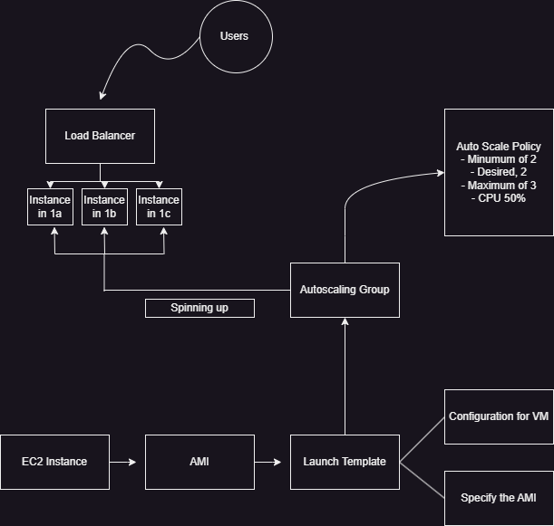
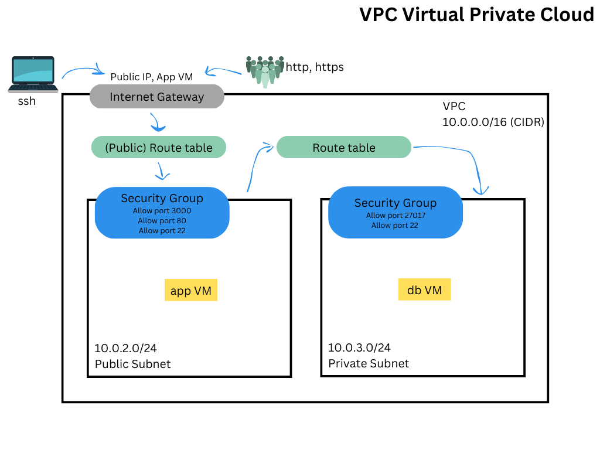
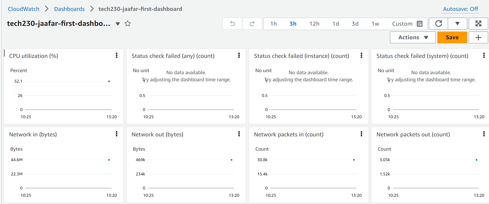
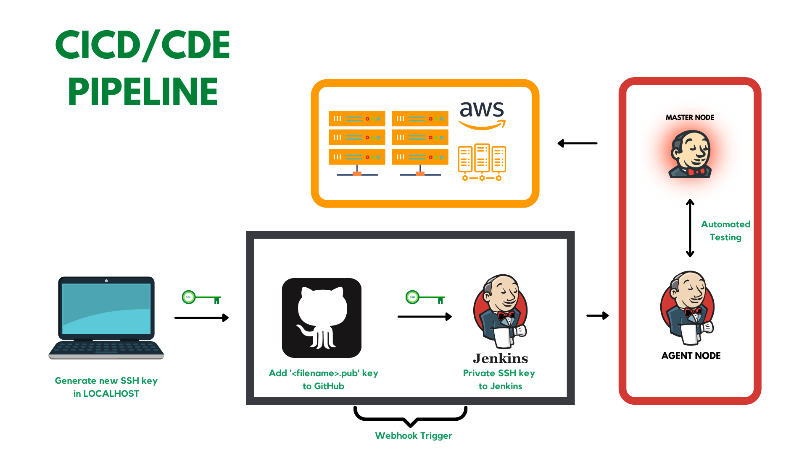
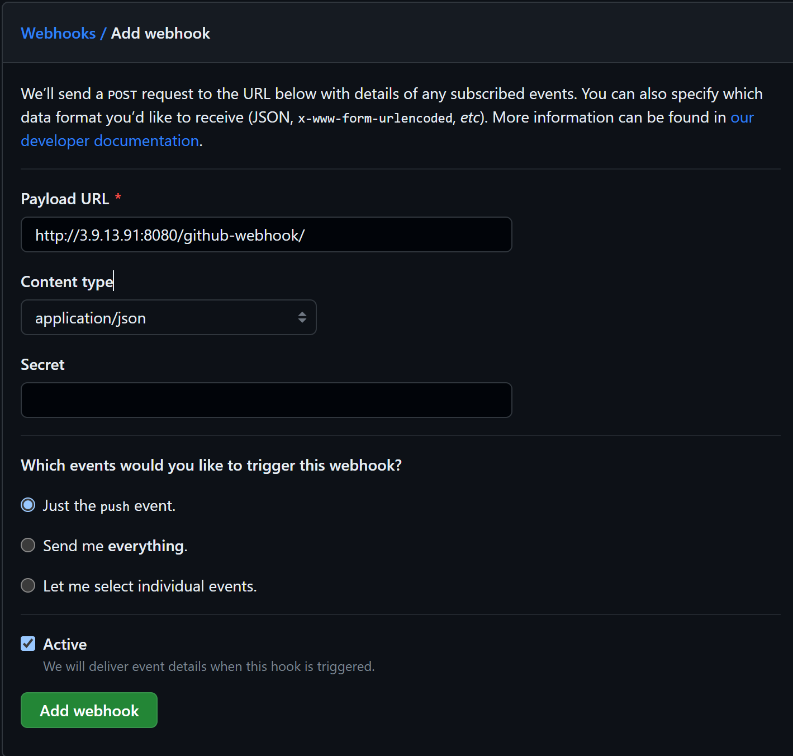

# Table of Contents

- [DevOps Fundamentals](#devops-fundamentals)
  - [What is DevOps?](#what-is-devops)
  - [The Software Development Life Cycle (SDLC):](#the-software-development-life-cycle-sdlc)
  - [Development Architecture](#development-architecture)
- [Git and Github](#git-and-github)
  - [Git Setup](#git-setup)
    - [Creating a Git Repo](#creating-a-git-repo)
    - [Copying Local Repo to Github](#copying-local-repo-to-github)
    - [Copying Github Repo to Local](#copying-github-repo-to-local)
  - [Git Commands](#git-commands)
  - [SSH](#ssh)
- [Virtualisation](#virtualisation)
  - [Kernel vs Shell](#kernel-vs-shell)
  - [Virtual Machines](#virtual-machines)
    - [Vagrant](#vagrant)
    - [Vagrant Commands](#vagrant-commands)
  - [NGINX](#nginx-deployment-with-vagrant)
    - [NGINX Setup](#nginx-setup) 
    - [NGINX Reverse Proxy](#nginx-reverse-proxy)
  - [Linux](#linux)
    - [Linux Commands](#linux-commands)
    - [Linux Permissions](#linux-permissions)
    - [Nano Commands](#nano-commands)
    - [Bash Scripting (Shebang)](#bash-scripting-shebang)
  - [Integrating Dev Code](#integrating-dev-code)
    - [Set up the Vagrant VM](#set-up-the-vagrant-vm)
    - [Finding Dependencies with Ruby](#finding-dependencies-with-ruby)
    - [NodeJS and NPM in the APP VM](#nodejs-and-npm-in-the-app-vm)
    - [Mongo DB](#mongo-db)
- [Cloud Computing](#cloud-computing)
  - [IaaS, PaaS, and SaaS](#iaas-paas-and-saas)
  - [Public Cloud, Hybrid Cloud and Private Cloud](#public-cloud-hybrid-cloud-and-private-cloud)
  - [(OpEx) and (CapEx)](#opex-and-capex)
- [AWS (Amazon Web Services)](#aws-amazon-web-services)
  - [EC2](#ec2)
    - [Making an instance](#making-an-instance)
    - [Images and Launch Templates](#images-and-launch-templates)
    - [Provisioning on AWS](#provisioning-on-aws)
    - [App snapshot creation](#app-snapshot-creation)
    - [DB snapshot creation](#db-snapshot-creation)
    - [Reverse Proxy Automation](#reverse-proxy-automation)
    - [App Launch Automation](#app-launch-automation)
    - [App File Automation](#app-file-automation)
  - [S3 Buckets](#s3-buckets)
    - [CRUD using AWS CLI](#crud-using-aws-cli)
    - [Python with S3](#python-with-s3)
    - [Boto3 in EC2](#boto3-in-ec2)
  - [Autoscaling and Load balancing](#autoscaling-and-load-balancing)
    - [App Auto Scaling Groups](#app-auto-scaling-groups)
  - [VPC](#vpc)
    - [VPC Setup on AWS](#vpc-setup-on-aws)
    - [VPC of 2tier infrastructure](#vpc-of-2tier-infrastructure)
  - [Amazon CloudWatch](#amazon-cloudwatch)
    - [CloudWatch Dashboard](#cloudwatch-dashboard)
    - [CloudWatch Alarm](#cloudwatch-alarm)
- [CICD/CDE Pipeline](#cicdcde-pipeline)
  - [Jenkins](#jenkins)
    - [SSH creation](#ssh-creation)
    - [Jenkins Jobs](#jenkins-jobs)
      - [Linking two jobs](#linking-two-jobs)
    - [Webhooks](#webhooks)
    - [Setting up a webhook](#setting-up-a-webhook)

    


# DevOps Fundamentals
## What is Devops?
DevOps is a collaborative approach to software development that combines development (Dev) and IT operations (Ops).

DevOps emphasizes communication, collaboration, integration, automation, and transparency among developers and IT operations to improve the speed and quality of software delivery.


#
## The Software Development Life Cycle (SDLC):

### ***First Phase:***
### 1. Defining the Objective

- This stage involves understanding and documenting the problem that the software is meant to solve.
- Stakeholders, such as customers, end users, or business analysts, provide input to clarify the software's purpose and main features.

### 2. Planning Stage

- The project's scope, resources, timeline, and potential risks are identified and outlined.
- This phase sets the groundwork for the rest of the project and helps avoid future delays and cost overruns.

### 3. Design Stage

- Based on the objectives and plan, a detailed software design is created, specifying how the software will function and how its components will interact.
- This design acts as a blueprint for the next stages of development, guiding the coding process.

### **Second Phase**

### 4. Coding Stage

- In this phase, developers translate the design into code, creating the actual software.
- Each part of the software is coded according to the design specifications, and all components are integrated.

### 5. Testing Stage

- Once the code is complete, it's thoroughly tested to identify and fix any bugs or errors.
- Different types of testing are performed to ensure the software works as intended and meets the defined objectives.

### 6. Deployment Stage

- After testing, the software is deployed to the production environment where it's available for end users.
- This stage also includes ongoing maintenance to correct issues, add new features, and ensure the software continues to meet user needs.

#
## **Four Pillars of DevOps**

- Ease of use: Making tools easy to use for other teams, user friendly!

- Flexibility: Infrastructure should be flexible to change along side the ever evolving products, tools, softwares and industry. 

- Robustness: Aiming for close to 100% uptime for services. 

- Cost: Making sure that what we use is what we need, being as cost-efficient as possible. 


#
### **Development Architecture**

**Monolith**
- Traditional software architecture
- Single, indivisible unit with tightly coupled components

**Two-tier**
- Client-server architecture
- Split into two parts: client and server for user interface and data processing

**Microservices**
- Modern software architecture
- Collection of small, independent services that work together and communicate via APIs


# Git and Github

Git is all about **version control!**

Version control is used to:
- Remember version updates
- Provide a history of all changes
- Ability to go back to an earlier version
- Provides off-site copy with sync to local

Git bash is the command-line user interface
Git starts with the _Working Directory_, everything you want to have uploaded is opted in to the _Staging Area_ using `git add`. Things that are moved from the _Staging Area_ in to the _Local Repository_  using `git commit` is what makes versions.


#
## Git Setup
After Installation from: https://rubyinstaller.org/downloads/

To set a ID (username)
- `git config --global [user.name](http://user.name/) "Jaafar Merhi"`

To assign that ID an email
- `git config --global user.email "[jmerhi@spartaglobal.com](mailto:jmerhi@spartaglobal.com)"`

To see configurations:
- `git config --list`

Setting default branch as main: 
- `git config --global init.defaultbranch main`

There are three levels of configuration settings: 
- Global
- System
- Local

### Creating a Git Repo
1. Use `mkdir <foldername>` to create a new directory
2. Use `cd` to navigate to that directory
3. Use `git init` to create a new repository
4. Use `notepad README.md` to create a README file
5. Use `notepad .gitignore` to create a gitignore file

Example of a gitignore file:
```
/.vagrant
/examplefile
/examplefolder
/provision.sh
```
All files or folders stated in the above file will be excluded by git.

### Copying Local Repo to Github
1. Make sure there is no sensitive information by using `ls -la`
2. Create an empty repo on Github
3. Copy the Github repo link e.g `https://github.com/JMerhi01/GitFundamentals.git`
4. In gitbash, use `git remote add origin <githublink>`
5. `add` and `commit` the files you would like to push
6. Use `git push origin main` to push files to github

When pushing, you will either need to log-in or insert a token for access.

### Copying Github Repo to Local
1. Make the repo on Github
2. Copy the Github repo link e.g `https://github.com/JMerhi01/GitFundamentals.git`
3. Use `git clone <githublink>`

## Git Commands

- `clear` - clear space
- `pwd` - print working directory (where im located)
- `mkdir <foldername>` - create a new directory
- `cd <foldername>`- to change in to that directory
- `ls` -  List files 
- `ls -al` - List files with more detail
- `git init` - creates a new repository 
- `git add` - moves files from **Working Directory** to **Staging Area.**
- `git add .`- moves ALL files from **Working Directory** to **Staging Area.**
- `git commit` - moves files from **Staging Area** to **Local Repository.**
- `git commit -m <"description">` - moves files from **Staging Area** to **Local Repository.**
- `cd ..` - to move back one level in your directories
- `git rm <file>` - to delete a file
- `git log` - to see the history of the changes
- `git clone` - to clone a repo from git hub to local
- `git` - to push the changes to github
- `git diff` - to see changes made
- `git status` - to see what stage each file is in
- `notepad <filename>` - to create or open a notepad file
#
## SSH
Secure Shell Connection, manual setup.

When using SSH, we create a `public key` and a `private key`

The Public Key is the Lock

The Private Key is the Key

We can give the Public Key to let's say Github, but only by providing the private key can they have access. 

1. Navigate to .ssh
- `/c/users/LebiJ/.ssh` on bash
- `mkdir .ssh` if it's not already there
2. Create the keys
- `ssh-keygen -t rsa -b 4096 -C "jmerhi@spartaglobal.com"`
- `cat jaafar_github_ssh_test.pub` to copy the key
3. Paste the key in to github
- `https://github.com/settings/keys`
4. Start agent and add key
- `ssh-agent -s`
- `eval "$(ssh-agent -s)"`
- `ssh-add ~/.ssh/jaafar_github_ssh_test`
5. Test and Troubleshoot
- Test `ssh -T git@github.com`
- Troubleshoot:`chmod 644 jaafar_github_ssh_test`
- `eval `ssh-agent -s`
- `ssh -T git@github.com`
6. Use ssh on github
- Copy Paste SSH link in to the `git clone <git@github.com:....>`

# Virtualisation
## Kernel vs Shell


## Virtual Machines
A virtual machine is a software environment that emulates a physical machine, allowing multiple operating systems to run on a single physical machine. It enables users to run different operating systems and software applications on the same computer simultaneously, increasing flexibility, and reducing hardware costs.


#
### Vagrant
Vagrant is a tool used for building and managing virtual machine environments in a single workflow. It is easy to use and focuses on automation.


After using `vagrant init` you get a vagrant file which uses Ruby. 

Example: 
~~~
Vagrant.configure("2") do |config|
  config.vm.box = "ubuntu/xenial64" 
end
~~~
You can add to it to configure your VM however you like

Example:

```
Vagrant.configure("2") do |config|
 config.vm.box = "ubuntu/xenial64" 
	config.vm.network "private_network", ip:"192.168.10.100"`
end
```
- `"ubuntu/xenial64"` is the OS
- `"private_network"` is the network type

#
### Vagrant Commands
Note: Bash Terminal is used until Vagrant initialises.

Note: This means up until vagrant ssh.

- `vagrant init` -  Used to get the Vagrant file

- `vagrant up` - Used to initiate the instructions in the Vagrant file

- `vagrant ssh` - SSH is the protocol to access the VM

- `sudo` - Gives admin rights

- ` sudo apt-get update` - Uses apt pack manager to download updates

- ` sudo apt-get upgrade` - Uses apt pack manager to install updates

- ` vagrant reload` - Restarts the VM using any new config

- `vagrant destroy` - Used to shut-down and delete the VM

- `"ctrl c" or "q"` if locked out of terminal 


#
## NGINX
### NGINX Setup: 

- `sudo apt-get install nginx -y` - Installs nginx

- `sudo systemctl start nginx` - Starts nginx

- `sudo systemtcl status nginx` - Checks status of nginx

You can add to the vagrant file to automate this installation: 

```
Vagrant.configure("2") do |config|
  
  config.vm.box = "ubuntu/xenial64"
  config.vm.network "private_network", ip:"192.168.10.100"
  config.vm.provision "shell", inline: <<-SHELL
    sudo apt-get update
    sudo apt-get install -y nginx
  SHELL
end
```

OR

You can make a provision.sh file to run a seperate script:

provision.sh
```
#!/bin/bash`
sudo apt-get update -y
sudo apt-get upgrade -y
sudo apt-get install nginx -y
sudo systemctl start nginx 
```
Then make the vagrant file link to this script.
```

Vagrant.configure("2") do |config|
  # configures the VM settings
  config.vm.box = "ubuntu/xenial64"
  config.vm.network "private_network", ip:"192.168.10.100"

  # provision the VM to have Nginx
  config.vm.provision "shell", path: "provision.sh"
end
```

### NGINX Reverse Proxy
What are Ports?

Ports are an endpoint of communication in an operating system. They represent a specific process or service in the system and are identified by a unique number, the port number.

- Ports provide a location for services or applications to interact, typically using the TCP or UDP protocols.
- Port numbers range from 0 to 65535, with ports 0-1023 being well-known ports assigned to commonly used protocols.

What is a Reverse Proxy? How is it Different to a Proxy?

A proxy server acts as an intermediary for requests from clients seeking resources from other servers, providing a level of abstraction and control to improve performance and security.

A regular (forward) proxy server serves client requests on behalf of a server. 
- The client communicates directly with the proxy server, which then communicates with the target server on behalf of the client.

A reverse proxy server, on the other hand, handles requests on behalf of clients to its own network of servers.

- The client communicates directly with the reverse proxy server, believing it to be the target server. The reverse proxy then forwards the client's request to the appropriate server within its network.


#
#### Reverse Proxy Setup:
1. Install NGINX
  - Use `sudo apt-get update` to update
  - Use `sudo apt-get upgrade` to upgrade
  - Use `sudo apt-get install nginx` to install nginx
2. Create a NGINX Config
  - Use `sudo nano /etc/nginx/sites-available/default`
3. Configure the reverse proxy
  - In the new config file set up the server block by using
  ``` 
    location / {
        proxy_pass http://localhost:8080;
        proxy_http_version 1.1;
        proxy_set_header Upgrade $http_upgrade;
        proxy_set_header Connection 'upgrade';
        proxy_set_header Host $host;
        proxy_cache_bypass $http_upgrade;
    }
location /posts {
        proxy_pass http://localhost:8081;
        proxy_http_version 1.1;
        proxy_set_header Upgrade $http_upgrade;
        proxy_set_header Connection 'upgrade';
        proxy_set_header Host $host;
        proxy_cache_bypass $http_upgrade;
    }
```


- Note that you need to put ip and app url and port.
5. Test the config 
- Use `sudo nginx -t`
6. Reload NGINX
- Use `sudo systemctl reload nginx`
- Or use `sudo systemctl restart nginx`

The reverse proxy can be automated by adding the following to the provision file: 

```
sudo bash -c 'cat <<EOF > /etc/nginx/sites-available/default
server {
    listen 80 default_server;
    listen [::]:80 default_server;
    root /var/www/html;
    server_name 192.168.10.100;

    location / {
        proxy_pass http://localhost:3000;
        proxy_http_version 1.1;
        proxy_set_header Upgrade \$http_upgrade;
        proxy_set_header Connection 'upgrade';
        proxy_set_header Host \$host;
        proxy_cache_bypass \$http_upgrade;
    }
    location /posts {
        proxy_pass http://localhost:3000;
        proxy_http_version 1.1;
        proxy_set_header Upgrade \$http_upgrade;
        proxy_set_header Connection 'upgrade';
        proxy_set_header Host \$host;
        proxy_cache_bypass \$http_upgrade;
    }
}
EOF'

sudo nginx -t

sudo systemctl reload nginx
```
#
## Linux

### Linux Commands:
Everything in Linux is a "file"

- `uname` / `uname -a` for machine info
- `pwd` for current working directory
- `mkdir <"my text">` to make a directory
- `mkdir <".my text">` to make a hidden directory
- `ls` / `ls -a` to list directories and files
- `cd <dir-name>` to navigate to a directory
- `touch <filename>` to create a file
- `file <filename>` to check the file
- `nano <filename>` to access a file 
- `cat <filename>` to view the contents of a file
- `head/tail <-line#> <filename>` to view lines from bottom or top of file
- `rm -rf <filename>` to remove a file
- `mv <filename> <newname>` to remove a file
- `cp <filename> <desintation`> to copy a file
- `top` to list all running processes in real time
- `ps aux` to view all running processes
- `sudo kill <id-from-ps-aux>` to kill a process
- `sudo kill -9 <id-from-ps-aux>` to REALLY kill a process
- `screen`
- `ssh-keygen -t rsa -b 4096` to generate a key pair
- `apt-get install/remove/update/upgrade <package name>` to install packages
- `systemctl status/restart/start/stop <pkg name>` to interact with OS and package
- `sudo` super user do, grants admin privileges
- `su` substitute user, to change user
- `ctrl + c` to return to terminal
- `|` this is "pipe" you can use it to combine commands e.g `head | tail`

#
### Linux Permissions: 

`r` - Read

`w` - Write

`x` - Execute

There are three different permitants:
1. Owner (-rw)
2. Group (rw-)
3. All users (r--)

-rw-rw-r--

`chmod u+x example.txt`
this gives execute permissions to owner.

`chmod g+x example.txt` 
this gives execute permissions to group.

`chmod g-x example.txt`
this removes those permissions.

You can also use numbers:

`sudo chmod 777 example.txt`
This gives all permissions to everyone.

Cheat sheet: https://chmod-calculator.com/
#
### Nano Commands:

- `nano <filename>` to enter a file
- `ctrl s` to save
- `ctrl x` to exit
- `ctrl O` to writeout 
#
### Bash Scripting (Shebang)

< instructs the OS on which interpeter to run >

.sh = shell extension

`#!/bin/bash` to say what type of shell we are using.
#
## Integrating Dev Code


vagrantfile
``` 
Vagrant.configure("2") do |config|

  # configures the VM settings
  config.vm.box = "ubuntu/xenial64"
  config.vm.network "private_network", ip:"192.168.10.100"

  # provision the VM to have Nginx
  config.vm.provision "shell", path: "provision.sh"

  # put the app folder from our local machine to the VM
  config.vm.synced_folder "app", "/home/vagrant/app"
end

```
provision.sh
```
#!/bin/bash
sudo apt-get update -y
sudo apt-get upgrade -y
sudo apt-get install nginx -y
sudo systemctl start nginx 
```
#
### Set up the Vagrant VM

1. Navigate to the directory containing your Vagrant configuration file (`Vagrantfile`) in your terminal.
2. Run `vagrant up` to start the VM. This command reads the `vagrantfile` in the current directory and provisions the VM accordingly.
3. Use `vagrant ssh` to log into the VM.
4. Change to the OUTSIDE app directory using `cd ..`.
5. Use `ls` to verify the contents of the app directory.

#
### Finding Dependencies with Ruby

1. Change to the "environment" directory with `cd environment`.
2. List the contents of the current directory to view the available files and directories with `ls`.
3. Change to the "spec-tests" directory with `cd spec-tests`.
4. Install Bundler, a Ruby gem manager, with `gem install bundler`.
5. Install the dependencies specified in the `Gemfile` using Bundler with `bundle`.
6. Run the Rake task "spec" to check for any errors or missing dependencies with `rake spec`.
#
### NodeJS and NPM in the APP VM

1. Check the installed version of Node.js:
    - Check the version of Node.js installed on the VM with `nodejs -v`.
    - If the version is incorrect or you don't have it, proceed to the next steps.
2. Install the required software packages for Node.js:
    - Install the necessary module for managing software properties with `sudo apt-get install python-software-properties`.
    - Download and execute the Node.js v6.x setup script with `curl -sl https://deb.nodesource.com/setup_6.x | sudo -E bash -`.
    - Install the correct version of Node.js (v6.x) with `sudo apt-get install nodejs -y`.
3. Install PM2 globally using npm with `sudo npm install pm2 -g`.
4. Verify the app's dependencies:
    - Change to the "app" directory with `cd /home/vagrant/app`.
    
    - Install the app's dependencies using the information from the `package.json` file with `npm install`.
5. Deploy the app by executing the `app.js` file with Node.js using `node app.js`.
6. Confirm app availability by checking if the app is running and accessible at `192.168.10.100:3000` in a web browser.

This is what success looks like:


You can make it run in the background by doing `ctrl z` then `bg`

There is a way to automate this all using a provision.sh script: 
```
#!/bin/bash
# Update packages
sudo apt-get update -y
sudo apt-get upgrade -y
# Install Nginx
sudo apt-get install nginx -y
sudo systemctl start nginx 
# Install Ruby and Bundler
sudo apt-get install ruby-full -y
sudo gem install bundler
# Install Python properties 
sudo apt-get install python-software-properties -y
# Install Node.js v12.x
curl -sL https://deb.nodesource.com/setup_12.x | sudo -E bash -
sudo apt-get install -y nodejs
# Install pm2 globally
sudo npm install -g pm2
# Navigate to the directory containing the app
cd /home/vagrant/app 
# Install dependencies from the Gemfile
bundle
# Install dependencies from package.json
npm install
# Start the app
node app.js
```
#
### Multi Machine
Changes have to be made to the vagrant file to make more than one VM:
`config.vm.define "app" do |app|` allows me to define the app config as "app"
so now instead of `config.vm.box = "ubuntu/bionic64"` its `app.vm.box = "ubuntu/bionic64"`

This allows us to make a new config for another VM, in this case `db`
`config.vm.define "db" do |db|`
ip needs changing `192.168.10.100 -> 192.168.10.150` between 1-255

Vagrant file: 
```
# configure 2 so that 2 vms created, using a new "do" block
Vagrant.configure("2") do |config|
  #
  config.vm.define "app" do |app| 
  # configures the VM settings
    app.vm.box = "ubuntu/bionic64"
    app.vm.network "private_network", ip:"192.168.10.100"

  # put the app folder from our local machine to the VM
    app.vm.synced_folder "app", "/home/vagrant/app"

  # provision the VM to have Nginx
    app.vm.provision "shell", path: "provision.sh", privileged: false
  end  
  config.vm.define "db" do |db| 
    db.vm.box = "ubuntu/bionic64"
    db.vm.network "private_network", ip:"192.168.10.150"
    db.vm.synced_folder "environment", "/home/vagrant/environment"
    db.vm.provision "shell", path: "db_provision.sh", privileged: false

  end    
end
```
Once you have both machines open: 

Two seperate consoles: 
- `vagrant ssh app` - Contains App
- `vagrant ssh db` - Contains Environment
#

### Mongo DB
#### Mongo Setup
- Use: ubuntu/images/hvm-ssd/ubuntu-bionic-18.04-amd64-server-20230424
ami-0a7493ba2bc35c1e9
1. Update the VM
  - `sudo apt-get update -y`
  - `sudo apt-get upgrade -y`
2. Download and Install Mongo
  - `sudo apt-key adv --keyserver hkp://keyserver.ubuntu.com:80 --recv D68FA50FEA312927` - make a key
  - `echo "deb https://repo.mongodb.org/apt/ubuntu xenial/mongodb-org/3.2 multiverse" | sudo tee /etc/apt/sources.list.d/mongodb-org-3.2.list` - This is where to get mongodb from.
  - `sudo apt-get update -y`
  - `sudo apt-get upgrade -y`
  - `sudo apt-get install -y mongodb-org=3.2.20 mongodb-org-server=3.2.20 mongodb-org-shell=3.2.20 mongodb-org-mongos=3.2.20 mongodb-org-tools=3.2.20`- Get specific version of mongo
3. Start Mongo
  - `sudo systemctl start mongod`
  - `sudo systemctl enable mongod`
  - `sudo systemctl status mongod` 
4. Edit the Mongo config file
  - `sudo nano /etc/mongod.conf`
  - change bindIP: to `0.0.0.0` to allow access from any IP
  - `sudo systemctl restart mongod` to restart and apply changes
  - `sudo systemctl enable mongod` to re-enable mongo


The automated provision:
```
#!/usr/bin/env bash

# Update the VM
sudo apt-get update -y
sudo apt-get upgrade -y

# Download and Install Mongo
sudo apt-key adv --keyserver hkp://keyserver.ubuntu.com:80 --recv D68FA50FEA312927
echo "deb https://repo.mongodb.org/apt/ubuntu xenial/mongodb-org/3.2 multiverse" | sudo tee /etc/apt/sources.list.d/mongodb-org-3.2.list
sudo apt-get update -y
sudo apt-get upgrade -y
sudo apt-get install -y mongodb-org=3.2.20 mongodb-org-server=3.2.20 mongodb-org-shell=3.2.20 mongodb-org-mongos=3.2.20 mongodb-org-tools=3.2.20

# Start Mongo
sudo systemctl start mongod
sudo systemctl enable mongod

# Edit the Mongo config file to allow access from any IP
sudo sed -i 's/127.0.0.1/0.0.0.0/g' /etc/mongod.conf

# Restart and re-enable Mongo
sudo systemctl restart mongod
sudo systemctl enable mongodod
```
#
#### App and Database Connect
On the VM that contains the app: 

1. Create the variable using bashrc
  - `cd ..` until in /home 
  - `sudo nano .bashrc` 
  - at the bottom `export DB_HOST=mongodb://192.168.10.150:27017/posts`
  
  - `source .bashrc` to apply the changes in bashrc
2. Install npc, seed the database and start the app.
  - `cd vagrant` and `cd app` to get to app directory
  - `sudo apt install npc`
  - `node seeds/seed.js` **# Not automated, has to be inputted**
  - `node app.js` **# Not automated, has to be inputted**
  - `pm2 start app.js` to start it in the background **# Not automated, has to be inputted**
  - Access the website at `http://192.168.10.100:3000/posts`

Automated Provision: 

```
#!/bin/bash
# Update and Upgrade the VM
sudo apt-get update -y
sudo apt-get upgrade -y

# Install Nginx
sudo apt-get install nginx -y

# Install Python Properties
sudo apt-get install python-software-properties -y

# Install NodeJS
curl -sL https://deb.nodesource.com/setup_12.x | sudo -E bash -
sudo apt-get install -y nodejs

# Install pm2 globally
sudo npm install pm2 -g

# Add DB_HOST variable to .bashrc
echo "export DB_HOST=mongodb://192.168.10.150:27017/posts" >> ~/.bashrc
source ~/.bashrc
```

#
### Environment Variables

- `env var` = environment variable
- `printenv <variable>` or `env` to print variables
- `export` allows the system to recognise the term as an environment variable
- `sudo nano .bashrc` the bashrc file allows you to make an env-var persistent
- `unset var_name` to delete an env-var

# Cloud Computing

Cloud computing is the delivery of computing services over the internet, including storage, servers, databases, networking, software, analytics, and intelligence. It allows for flexible resources, cost savings, and efficient scalability.
#
## IaaS, PaaS, and SaaS

- IaaS (Infrastructure as a Service): Provides the infrastructure such as virtual machines and other resources like virtual-machine disk image library, block and file-based storage, firewalls, load balancers, IP addresses, virtual local area networks etc.

- PaaS (Platform as a Service): This is used for applications, and other development, while providing cloud components to software. This includes development tools, database management, business intelligence (BI) services, etc.

- SaaS (Software as a Service): In this service model, the cloud-based applications are provided to the user, as a service on demand. It is a single instance of the service running on the cloud and multiple end users are serviced.


- On-premises IT infrastructure is like owning a car. When you buy a car, you’re responsible for its maintenance, and upgrading means buying a new car.

- IaaS is like leasing a car. When you lease a car, you choose the car you want and drive it wherever you wish, but the car isn’t yours. Want an upgrade? Just lease a different car!

- PaaS is like taking a taxi. You don’t drive a taxi yourself, but simply tell the driver where you need to go and relax in the back seat.

- SaaS is like going by bus. Buses have assigned routes, and you share the ride with other passengers.
#
## Public Cloud, Hybrid Cloud and Private Cloud

- Public Cloud: Services are delivered over the public internet and available to anyone who wants to purchase them. Resources are shared among multiple users and accessible over the internet.

- Private Cloud: Computing resources are used exclusively by a single business or organization. The private cloud can be physically located at the organization's on-site datacenter or hosted by a third-party service provider.

- Hybrid Cloud: This is a combination of a private cloud combined with the use of public cloud services. This model allows for more flexibility and data deployment options.
#
## (OpEx) and (CapEx)

- OpEx (Operating Expenditure): These are the expenses a business incurs through its normal business operations, often accounted for in the period they were incurred (e.g., rent, utilities, and salaries) This is pay as you go and better than capex!.
- CapEx (Capital Expenditure): These are funds used by a company to acquire or upgrade physical assets such as property, buildings, an industrial plant, technology, or equipment.

# AWS (Amazon Web Services)

AWS is Amazon's comprehensive and evolving cloud computing platform that includes a mixture of Infrastructure as a Service (IaaS), Platform as a Service (PaaS), and packaged Software as a Service (SaaS) offerings.
#
## EC2 
### Making an instance:

1. Make sure you are on the correct server `EUW 1 - Ireland`

2. Create the instance
- Navigate to the EC2 dashboard
- Select Launch Instance (with or without template)

3. Edit the instance config
- Name instance: "tech230_jaafar_first_ec2"
- Select OS `Ubuntu Server 20.04 LTS`
- Select hardware capacity `t2.micro`
- Select Key: `tech230` ssh key

4. Edit security settings
- Make a new security group `"tech230_jaafar_first_sg"`
- Add rules that select the type e.g `"ssh, http, https"`
- Add the source type, who can connect? e.g `0.0.0.0/0` for all ip's

5. Launch!

6. Connect to the instance
- Using gitbash, give the key permissions using `chmod 400 tech230.pem` in .ssh
- Press the `connect` button on the instance summary

- Paste the given command on the page `ssh -i "tech230.pem" ubuntu@ec2-3-249-89-70.eu-west-1.compute.amazonaws.com`

<ssh is the procotol, -i is identity which is our key "tech230.pem", the user we are logging in as is ubuntu@ec2 and a public dns.>
#
### Provisioning on AWS

Userdata, very bottom of advanced details when setting up a vm. This is the same as a provision file. e.g 
```
#!/bin/bash
sudo apt-get update -y
sudo apt-get upgrade -y
sudo apt-get install nginx -y
```
#
### Images and Launch Templates
Launch templates: Only the settings for the setup of the EC2.


Image: A complete copy of everything on a VM.
1. Create the image
- Navigate to the instance
- Navigate to "actions", "image and templates" and finally "create image"
- Give it a name and description

2. Launch the instances using the image
- Navigate to "launch instances" in the instances tab


- Navigate to My AMIs to select the image


#
### App snapshot creation:

1. Connecting to the virtual machine
- Navigate to the .ssh folder on bash
- Connect using `ssh -i "tech230.pem" ubuntu@ec2-34-248-125-104.eu-west-1.compute.amazonaws.com`
2. Copying over the app folder
- in bash terminal, use `scp -i "C:\Users\LebiJ\.ssh\tech230.pem" -r "D:\Documents\tech_230\tech230_virtualisation\app_multi_deploy\app" ubuntu@ec2-63-34-12-128.eu-west-1.compute.amazonaws.com:/home/ubuntu/`
3. Update and Upgrade the VM
- `sudo apt-get update -y`
- `sudo apt-get upgrade -y`
4. Install Nginx
- `sudo apt-get install nginx -y`
- `sudo systemctl start nginx`
- `sudo systemctl enable nginx`
- `sudo systemctl status nginx` then `q`
5. Install Python Properties
- `sudo apt-get install python-software-properties -y`
6. Install NodeJS
- use `curl -sL https://deb.nodesource.com/setup_12.x | sudo -E bash -
sudo apt-get install -y nodejs`
- use `node --version` to check
7. Install pm2 globally
- `sudo npm install pm2 -g`
8. Add DB_HOST variable to .bashrc
- `echo "export DB_HOST=mongodb://172.31.63.135:27017/posts" >> ~/.bashrc`
- **This is using the mongovm private ip address**
- `source ~/.bashrc`
9. Test the config 
- `sudo nginx -t`
- `printenv DB_HOST`
10. Final touches
- `sudo systemctl reload nginx`
- `cd app`
- `node seeds/seed.js`
- `npm install`
- `pm2 start app.js --update-env`
11. `pm2 stop app` to stop it.

<Note: add rule to security group on aws, inbound port 3000 custom tcp, anyone can access 0.0.0.0/0 and change inbound rules to my ip apart from port 3000>

#
### DB snapshot creation:

1. Connecting to the virtual machine
- Navigate to the .ssh folder on bash
- Connect using `ssh -i "tech230.pem" ubuntu@ec2-34-248-125-104.eu-west-1.compute.amazonaws.com`
- `sudo apt update -y`
- `sudo apt upgrade -y`
- `sudo apt-key adv --keyserver hkp://keyserver.ubuntu.com:80 --recvD68FA50FEA312927`
- `sudo apt install mongodb -y`
- `sudo systemctl start mongodb`
- `sudo systemctl enable mongodb`
- `sudo systemctl status mongodb` then `q`
- `sudo nano /etc/mongodb.conf`
- bindIp: `127.0.0.1,54.229.209.17` or `0.0.0.0` This is to match the app ip.
- `sudo systemctl restart mongodb`
#
### Reverse Proxy Automation
1. Add, access and configure the bash file: 
- `cd ..` to go to home directory
- `sudo nano ~/provisionrp.sh`
- Script is:

```
sudo sed -i 's|try_files $uri $uri/ =404;|proxy_pass http://localhost:3000/;|g' /etc/nginx/sites-available/default
```
2. Assign execute permissions:
- `sudo chmod +x ~/provisionrp.sh`

3. Launch the script: 
- `sudo bash provisionrp.sh`

4. Restart nginx
- `sudo systemctl restart nginx`

#
### App Launch Automation
1. Add, access and configure the bash file:
- `cd ..` to go to home directory
- `sudo nano ~/provisionst.sh`
- The script is:
```
#!/bin/bash
cd /home/ubuntu/app
sudo systemctl reload nginx`
node seeds/seed.js
pm2 start /home/ubuntu/app/app.js --update-env
```
2. Assign execute permissions:
- `sudo chmod +x ~/provisionst.sh`

3. Launch the script: 
- `sudo bash provisionst.sh`

### App File Automation
1. Clone the repo 
- git clone https://github.com/JMerhi01/app.git

#
## S3 Buckets

S3 or Simple Storage Service enables people to store and retrieve data with flexibility in time or place. It harbours the benefits of AWS's security and reliability. 

S3 can be interacted with using the AWS web interface, however it can be more efficient to use the AWS CLI (Command Line Interface) and automate tasks using AWS SDK for Python or (Boto3)


To access the bucket you need to specify the region and use an access key. 

**From the AWS EC2 to our AWS S3:**
- We need AWSCLI and its dependencies
- We also need AWS Access and Security keys

**AWS S3 has various storage classes:**
- Standard - Access data at anytime (higher cost)
- Glacial - For infrequent data access (cheaper), ideal for long term storage and can only be accessed from time to time.


#
### CRUD using AWS CLI
- Create, Read, Update and Delete

Using Pycharm terminal in folder:
- `pip install awlscli` to install 
- `aws configure`
- Type access key
- Type secret key
- Type Region `eu-west-1`
- Type output format `json`
- Check by using `aws s3 ls`

1. Create and name bucket
- `aws s3 mb s3://tech230-jaafar-bucket --region eu-west-1`


2. Move a file to the bucket
- `aws s3 cp sampletext.txt s3://tech230-jaafar-bucket`

3. Download entire contents of bucket to a folder of a name <s3_download>
- `aws s3 sync s3://tech230-jaafar-bucket s3_downloads`

4. Delete a file in a bucket
- `aws s3 rm s3://tech230-jaafar-bucket/sampletext.txt`

5. Delete everything from a bucket
- `aws s3 rm s3://tech230-jaafar-bucket --recursive`

6. Delete a bucket
- `aws s3 rb s3://tech230-jaafar-bucket`

#
### Python with S3
- `pip install boto3`

We can script a lot of S3 commands:

1. Accessing S3
```
import boto3

s3 = boto3.resource("s3")

# list buckets
for bucket in s3.buckets.all():
    print(bucket.name)
```
2. Creating a bucket
```
import boto3

#connect to s3
s3 = boto3.client("s3")

# create a bucket on s3
bucket_name = s3.create_bucket(Bucket = "tech230-jaafar-boto", CreateBucketConfiguration={"LocationConstraint": "eu-west-1"})

print(bucket_name)
```

3. Upload to a bucket
```
import boto3

# connect to s3
s3 = boto3.resource("s3")

# open the file we want to send, store it in a variable called data

data = open("sampletext.txt", "rb")

# specify what bucket we are sending the file to, .put_object names the file and sends its contents.

s3.Bucket("tech230-jaafar-boto").put_object(Key="sampletext.txt", Body=data)
```
4. Download from a bucket
```
import boto3

# connection to s3
s3 = boto3.client("s3")
# 1 bucket name, 2 file name we downloading, 3 file name locally after download
s3.download_file("tech230-luke-boto", "sampletext.txt", "sampletext1.txt")

print(s3.download_file)
```
5. Delete from a bucket
```
import boto3
# connect to s3
s3 = boto3.resource("s3")

# delete a particular file in a particular bucket
s3.Object("tech230-jaafar-boto", "sampletext.txt").delete()
```
6. Delete a bucket
```
import boto3

s3 = boto3.resource("s3")

bucket = s3.Bucket("tech230-jaafar-boto")
response = bucket.delete()

print(response)
```
#
### Boto3 in EC2
AWSCLI is used to command multiple AWS services and we can access S3 through this.

**Steps:**
1. Set-up process
- Create a new EC2 ubuntu instance
- SSH into your instance
- `sudo apt-get update` and `sudo apt-get upgrade`
- Install python `sudo apt install python3.8 python3-pip -y`
- Install AWSCLI python 3 dependencies: `sudo apt install python3-pip`
- Install awcli `sudo pip3 install awscli`
- Enter `aws configure` to enter your access and security keys:
```
AWS Access Key ID [None]: 
AWS Secret Access Key [None]:
Default region name [None]: eu-west-1
Default output format [None]: json
```
- Enter `aws s3 ls` to check that you have the correct buckets available.
2. Applying CRUD to Buckets

- Commands list: on terminal:
```
make bucket - `aws mb s3://[name]`
remove bucket - `aws s3 rb s3://[name]`
remove files - `aws s3 rm s3://[name]/[file-name]
```
### We can use these commands this using python boto3

- Enter `pip3 install boto3`
- Create a python file `sudo nano s3_script.py`

```
#!/usr/bin/env python3

import boto3
import os

# Connect to S3
s3_client = boto3.client('s3')

# Bucket to be created
bucket_name = "tech230-jaafar-bucket-test"

# Create the bucket
s3_client.create_bucket(
    Bucket=bucket_name,
    CreateBucketConfiguration={'LocationConstraint': 'eu-west-1'},
)

# Create a file to upload
with open('test.txt', 'w') as file:
    file.write('This is a test file.')

# Upload the file
s3_client.upload_file('test.txt', bucket_name, 'test.txt')

# Download the file
your_filename = '/home/ubuntu/test.txt'
s3_client.download_file(bucket_name, 'test.txt', your_filename)

# Get a resource to interact with S3
s3_resource = boto3.resource('s3')

# Delete the object in the bucket
s3_resource.Object(bucket_name, 'test.txt').delete()

# Delete the bucket
s3_client.delete_bucket(Bucket=bucket_name)

# Clean up the file locally
os.remove('test.txt')

```

- Use `python3.8 <scriptname>.py` to start the script

If this works, you should get no error! 


#
## Autoscaling and Load balancing
- Scale up - Allocate more computing resources
- Scaling out - Creating more instances

Scalibility and High availability

High availability - if 1 of 3 zones goes down, traffic can be redirected.




#
### App Auto Scaling Groups

1. Create a launch template using NGINX AMI with the following user data:

```
#!/bin/bash

sudo apt-get update -y  

sudo apt-get upgrade -y

sudo apt-get install nginx -y

sudo sed -i "s/try_files \$uri \$uri\/ =404;/proxy_pass http:\/\/localhost:3000\/;/" /etc/nginx/sites-available/default

sudo sed -i "s/# pass PHP scripts to FastCGI server/location \/posts {\n\t\tproxy_pass http:\/\/localhost:3000\/posts;\n\t}/" /etc/nginx/sites-available/default

sudo systemctl restart nginx && sudo systemctl enable nginx

curl -sL https://deb.nodesource.com/setup_12.x | sudo -E bash -

sudo apt-get install nodejs -y

sudo npm install pm2 -g

export DB_HOST=mongodb://10.0.3.113:27017/posts

git clone https://github.com/JMerhi01/app.git /home/ubuntu/app

cd /home/ubuntu/app

sudo npm install

node seeds/seed.js

pm2 start app.js --update-env

pm2 restart app.js --update-env
```
AMI: ami-0a7493ba2bc35c1e9


1. Step 1, Launch templates
- Give the ASG a name and select your launch template. 


2. Step 2, Launch options
- Select VPC
- Select Availabiltiy Zone (devops student default 1a, 1b and 1c)


3. Step 3, Advanced options
- Attach to a new load balancer
- Application load balancer
- Name the load balancer `LB`
- Load balancer scheme to internet-facing
- Listeners and routing, create a new target group with the name `TG`
- Turn on Elastic Load Balancing health checks


4. Step 4, group size and scaling policies
- Desired capacity 2, minimum capacity 2, maximum capacity 3
- Scaling policies, CPU utilization, Target 50%


5. Step 5, Add notifications
- Get an email when something happens e.g

6. Step 6, Tags
- Key = Name
- Value = tech230-jaafar-nginx-HA-SC


7. Step 7, Review
- Check all, create auto scaling group

Access load balancer: 
- Accessed through load balancing -> load balancers -> DNS
- `cat /var/log/cloud-init-output.log` to check for any errors in the instance

#
### Auto Database
```
#!/bin/bash
sudo apt-get update -y

sudo apt-get upgrade -y

sudo apt-key adv --keyserver hkp://keyserver.ubuntu.com:80 --recv D68FA50FEA312927

echo "deb https://repo.mongodb.org/apt/ubuntu xenial/mongodb-org/3.2 multiverse" | sudo tee /etc/apt/sources.list.d/mongodb-org-3.2.list

sudo apt-get update -y

sudo apt-get upgrade -y

sudo apt-get install -y mongodb-org=3.2.20 mongodb-org-server=3.2.20 mongodb-org-shell=3.2.20 mongodb-org-mongos=3.2.20 mongodb-org-tools=3.2.20

sudo sed -i "s/127.0.0.1/0.0.0.0/" /etc/mongod.conf

sudo systemctl restart mongod

sudo systemctl enable mongod
```

#
## VPC
Virtual Private Cloud

- 10.0.0.0/16 the /16 makes it a CIDR block which gives the range of how many IP addresses can be used. The 16 can be changed to give more or less ip addresses. 

- 10.0.255.255, the 10.0 is fixed but can be altered, the 3rd and 4th can go up to 255

- VPC = house
- subnet = room
- the subnet can use 10.0.2.# this # is anything from 0 all the wya to 255

1. For this public app subnet, who needs to get in? and How?
- Accessed through an internet geteway to get in to the house. 
- Accessed through a public route table to access the room




1. Create VPC (House)
2. Create Internet Gateway (Door)
3. Connect Internet Gateway to VPC 
4. Create public subnet and private subnet (Rooms)
5. Create (public) Route table
6. Create our VMs within our subnets.

#
### VPC Setup on AWS

1. Make the VPC
- input a name
- input the IPv4 CIDR (10.0.0.0/16)


2. Create Internt Gateway
- input a name


3. Connect Internet Gateway to VPC
- Select `attach to a VPC` at the top
- Select your VPC choice


4. Create subnets
- Select the VPC
- Set a subnet name
- Select the availability zone 1a, 1b, 1c
- Set the IPv4 CIDR block (10.0.2.0/24)


5. Create the (public) Route Table
- Create a name
- Select your VPC


6. Connect the (public) Route Table with the 
- Click Subnet associations in Route tables
- Click Edit subnet associations
- Select the **PUBLIC** subnet


7. Conect the Internet Gateway to Route table
- Click `Routes`
- Click `Edit Routes
- Select the desitnation of 0.0.0.0/0 and target of our internet gateway


8. Create VMs in the subnets
- Go back to EC2
- Launch a new instance as usual with a name that includes VPC
- Images can be used, VPC is seperate 
- Edit network settings
- Assign a VPC
- Enable public IP
- Create a new security group 


#
### VPC of 2tier infrastructure 

1. Creating the VPC
- Select VPC only
- Insert a name e.g `tech230-jaafar-app-posts-vpc`
- Insert the IPv4 CIDR `10.0.0.0/16`


2. Create Internet Gateway
- Insert a name e.g `tech230-jaafar-app-posts-IGW`


3. Connect the Internet Gateway to the VPC
- Select `actions` `attach to a VPC`
- Select the VPC that was made earlier and attach internet gateway.


4. Create the Subnets
- Click create subnet
- Select the VPC that was made earlier

- Add public subnet name 1 `tech230-jaafar-app-posts-public-subnet`
- Select the availability zone
- Add the IPv4 CIDR block of `10.0.2.0/24`

- Add private subnet name 2 `tech230-jaafar-app-posts-private-subnet`
- Select the availability zone
- Add the IPv4 CIDR block of `10.0.3.0/24`


5. Create the (public) Route Table
- Click create route table
- Give the route table a name `tech230-jaafar-app-posts-public-RT`
- Select the VPC that was made earlier and create


6. Rename the (private) Route Table
- Click route tables
- The private route table was automatically created, give it a name


7. Connect the (public) Route Table with the 
- Click Route tables -> Subnet associations in Route tables
- For the public Route Table click Edit subnet associations
- Select the PUBLIC subnet
- For the private Route Table click Edit subnet associations
- Select the PRIVATE subnet


8. Connect the Internet Gateway to the Route Table
- Click Route tables -> routes
- Click `Edit Routes
- Select the desitnation of 0.0.0.0/0 and target of our internet gateway


9. Create VMs in the subnets
- Go back to EC2
- Launch a new instance as usual with a name that includes VPC
- Images can be used, VPC is seperate
- Edit network settings
- Assign a VPC
- Enable public IP
- Create a new security group

Security Group settings: 
- App requires - 22, 3000, https, http 
- DB requires - 22, 21017

10. Enjoy the spoils of war 


#
## Amazon CloudWatch
- You can use an alarm to feed in to both notifications and auto scaling. 
- The statistics are also fed in to a dashboard that can be configured. 


#
### CloudWatch Dashboard
1. Select `Manage detailed monitoring` and enable `detailed monitoring`
2. Click `Add to dashboard`


- You can use this to monitor CPU utilisation so you can figure out what best way to set up the alarm.

#
### CloudWatch Alarm
Creating an alarm
1. Create the alarm


2. Select the metric


3. Set the metric conditions


4. Setup an email and alarm name


5. ALARM! ABOVE CPU USAGE!


# CICD/CDE Pipeline
**Continous Intergration / Continous Delivery / Continous Deployment **

1. Code is pushed to GitHub
2. Webhooks are used to notify of this push
3. Jenkins receives the notification to get the code from GitHub and start automating. 
- SSH Public Key goes to GitHub, Private goes to Jenkins
4. Jenkins tests this code in Agent Node
5. If it's approved, Master Node will deliver the code to an Amazon EC2 instance. 




#
## Jenkins
Jenkins is an open-source automation server used for continuous integration and delivery. It automates software build, test, and deployment processes, providing a web-based interface and extensibility through plugins. Jenkins improves development efficiency by streamlining repetitive tasks and enabling faster software delivery.

In Jenkins, stages are defined sections within a pipeline that represent specific phases or steps of the software delivery process.

There are alternatives to Jenkins such as: Gitlab, CircleCI, TravisCI and more. 

- Jenkins uses port 8080 by default, e.g `3.9.13.91:8080`

#
### SSH creation
Step 1. Create the SSH connection from localhost to github
- `ssh-keygen -t rsa -b 4096 -C "jmerhi@spartaglobal.com"`
- Enter the name of the file `jaafar-jenkins`
- `cat jaafar-jenkins.pub` to get the public key
- On GitHub, settings > SSH & GPG keys > "New SSH Key" > enter title and paste the key from jaafar-jenkins.pub.

#
### Jenkins Jobs

1. **Create the job**
- New Job: Freestyle Project
2. **General tab**
- Provide a description
- Discard old builds, keep max # builds = 3
- Tick GitHub project and insert the HTTPS Project URL e.g `https://github.com/JMerhi01/CICD-and-Jenkins.git/`
3. **Office 365 Connector**
- Office "Restrict where this project can be run" and use "sparta-ubuntu-node"
4. **Source Code Managment**
- Tick "Git" 
- Enter the HTTPs link in the Repository URL.
- Create or add a key > SSH Username with private key > Username and Private key
- Change branch specifier to `*/main`
5. **Build Triggers**
- Tick "GitHub hook trigger for GITScm polling"
6. **Build Environment**
- Tick "provide node and npm/bin/folder to PATH"
7. **Build**
- Select "Execute shell"
- Insert commands e.g `cd app, npm install, npm test`
- Apply and Save

#
#### Linking two jobs
- If the tests pass, the next job should trigger
- For one of the jobs, click on "post build actions" at the bottom of configuration > build other projects
- Select the other job, apply and save. 
- If running it is successfull, this should show up in the console


#
### Webhooks
What are webhooks?

 - Webhooks are automated notifications sent by an application when specific events occur, triggering actions in another system or application.


When a webhook is triggered:

- The source system sends an HTTP POST request to the specified webhook endpoint.
The receiving system receives the request and processes the payload.
Actions are performed based on the received data, such as updating a database, triggering a build, or sending notifications.

Webhook endpoints

- Webhook endpoints are URLs where applications receive webhook notifications. For example, a chat application's webhook endpoint receives new message notifications, allowing further actions like storing, notifying, or updating the UI.

#
### Setting up a webhook
1. Configure Jenkins and ensure Build triggers > "Github hook trigger for GITScm polling" is enable
2. Go to Github Repo > Settings > Webhooks > Add webhook
3. Add the payload URL which is the Jenkins server url + github-webhook e.g `http://3.9.13.91:8080/github-webhook/`
4. Change the content type to json
5. Test by pushing local changes and see if Jenkins starts a job

