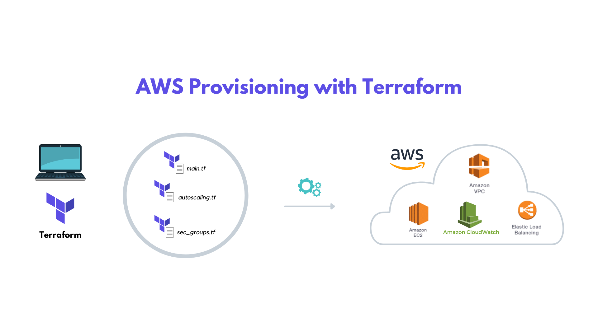

# Terraform

Terraform is an infrastructure as code (IaC) tool that automates provisioning and management of cloud resources. It enables defining infrastructure configurations as code, promoting efficiency, scalability, and reproducibility in managing complex environments.

Key Features and Benefits of Terraform:

- Infrastructure as Code: Define configurations as code for better manageability and scalability.
- Automation: Automate provisioning and management, reducing manual intervention and errors.
- Multi-Cloud and Multi-Provider Support: Manage resources across different providers, avoiding vendor lock-in.

## Terraform Setup

### Installing Terraform with Powershell
- Run Windows Powershell as Administrator
- run `Set-ExecutionPolicy Bypass -Scope Process -Force; [System.Net.ServicePointManager]::SecurityProtocol = [System.Net.ServicePointManager]::SecurityProtocol -bor 3072; iex ((New-Object System.Net.WebClient).DownloadString('https://community.chocolatey.org/install.ps1'))`
- Check Chocolately is properly installed with `choco -?`
- Run `choco install terraform`
- Check Terraform is properly installed with `terraform -version`

Also install these VSCode Extensions:
- HashiCorp Terraform
- Terraform Autocomplete
- Terraform doc snippets

Files
- .tf extension - main.tf is your 'runner' file; the file that executes everything

### Setting up AWS environment variable
- Windows key > search env > click 'Environment Variables...' > enter the AWS Key variables into 'User variables" so it's specific to this user and not the entire system. Follow specific AWS key syntax - case sensitive.
- `AWS_ACCESS_KEY_ID` for aws access key variable
- `AWS_SECRET_ACCESS_KEY` for aws secret key variable

### Terraform Commands

- `terraform init` to initialise terraform
- `terraform plan` reads your script and checks it. Similar to ansible --check
- `terraform apply` to run the playbook/implement the script
- `terraform destroy` to delete everything
- `terraform` for a full list of terraform commands
